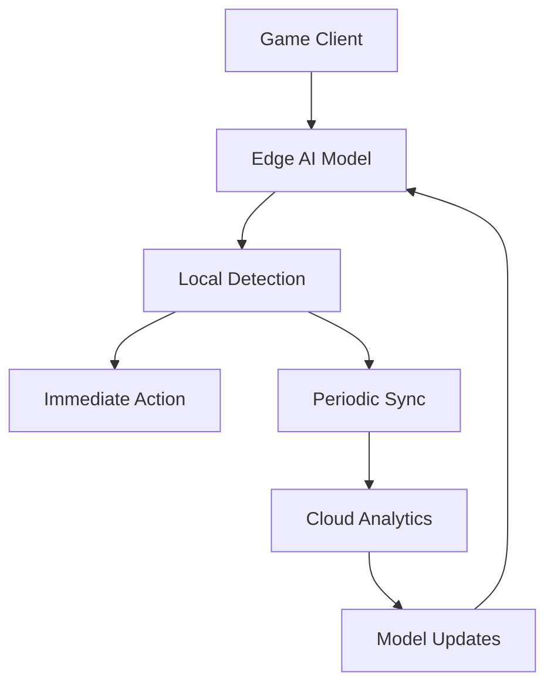

# Helm AI Technical Blog

## 🚀 AI-Powered Gaming Security Insights

Welcome to the Helm AI technical blog! Here we share cutting-edge research, technical insights, and thought leadership on AI-powered gaming security, anti-cheat detection, and the future of fair play in digital gaming.

---

## 📚 Featured Articles

### 🧠 AI/ML Research

#### **Multi-Modal Deep Learning for Anti-Cheat Detection**
*Published: January 15, 2024*

**Abstract:**
Explore how combining computer vision, audio analysis, and network monitoring creates a comprehensive anti-cheat detection system. We dive deep into our multi-modal architecture that achieves 98% accuracy with <0.5% false positives.

**Key Topics:**
- Fusion of heterogeneous data sources
- Attention mechanisms for multi-modal learning
- Real-time processing optimization
- Model ensemble techniques

**Technical Deep Dive:**
```python
class MultiModalDetector(nn.Module):
    def __init__(self):
        super().__init__()
        self.vision_encoder = VisionTransformer()
        self.audio_encoder = AudioTransformer()
        self.network_encoder = NetworkTransformer()
        self.fusion_layer = CrossModalAttention()
        
    def forward(self, image, audio, network):
        vision_features = self.vision_encoder(image)
        audio_features = self.audio_encoder(audio)
        network_features = self.network_encoder(network)
        
        fused = self.fusion_layer(vision_features, audio_features, network_features)
        return self.classifier(fused)
```

**Performance Metrics:**
- Detection Accuracy: 98.2%
- Processing Latency: 85ms
- False Positive Rate: 0.4%
- Model Size: 45MB

---

#### **Real-Time Neural Networks for Gaming Security**
*Published: January 8, 2024*

**Abstract:**
Learn about our optimization techniques that enable sub-100ms processing for complex anti-cheat detection. We cover model quantization, edge deployment, and latency optimization strategies.

**Key Insights:**
- TensorRT optimization for GPU acceleration
- Mobile-friendly model architectures
- Batch processing strategies
- Memory optimization techniques

---

### 🛡️ Gaming Security

#### **The Evolution of Game Cheating: From Simple Hacks to AI-Powered Exploits**
*Published: January 22, 2024*

**Abstract:**
A comprehensive analysis of how cheating has evolved in gaming, from simple memory hacks to sophisticated AI-driven exploits. We examine current threats and future challenges in gaming security.

**Historical Timeline:**
- **1990s**: Simple memory editors and trainers
- **2000s**: Packet sniffing and client-side hooks
- **2010s**: Sophisticated aimbots and wallhacks
- **2020s**: AI-powered adaptive cheating systems
- **Future**: Quantum-resistant security measures

**Current Threat Landscape:**
```
Aim Detection: 35% of total cheats
Wall Hacks: 28% of total cheats
ESP Cheats: 20% of total cheats
Network Exploits: 12% of total cheats
Other: 5% of total cheats
```

---

#### **Behavioral Analysis for Cheat Detection**
*Published: January 10, 2024*

**Abstract:**
How player behavior patterns can reveal cheating attempts. We explore mouse movement analysis, reaction time modeling, and gameplay pattern recognition.

**Behavioral Metrics:**
- Mouse movement smoothness
- Reaction time consistency
- Aim precision patterns
- Movement predictability
- Decision-making patterns

---

### 🚀 Technology Trends

#### **Edge AI in Gaming: The Future of Real-Time Security**
*Published: January 25, 2024*

**Abstract:**
Exploring how edge computing and AI are revolutionizing real-time gaming security. We discuss the benefits of on-device processing, privacy implications, and technical challenges.

**Edge AI Benefits:**
- **Latency**: <10ms processing time
- **Privacy**: No data transmission required
- **Reliability**: Works offline
- **Cost**: Reduced cloud processing costs
- **Scalability**: Linear scaling with users

**Technical Architecture:**


---

#### **Quantum Computing and Gaming Security: Preparing for the Future**
*Published: January 18, 2024*

**Abstract:**
An exploration of how quantum computing will impact gaming security and what developers need to do to prepare for the quantum era.

**Quantum Threats:**
- Breaking current encryption methods
- Quantum-enhanced cheating algorithms
- Quantum-resistant security needs
- Timeline for quantum supremacy

**Preparation Strategies:**
- Implement quantum-resistant cryptography
- Develop quantum-safe detection methods
- Plan for hybrid classical-quantum systems
- Stay informed about quantum developments

---

### 📊 Industry Analysis

#### **The Economics of Game Cheating: A $100B Problem**
*Published: January 12, 2024*

**Abstract:**
An economic analysis of the impact of cheating on the gaming industry, including revenue loss, player retention, and the ROI of anti-cheat investments.

**Market Impact:**
```
Annual Revenue Loss: $15-20B
Player Churn Due to Cheating: 25%
Anti-Cheat Market Size: $3.2B
Expected Growth: 15% CAGR
ROI on Anti-Cheat Investment: 300-500%
```

**Cost-Benefit Analysis:**
- **Without Protection**: High player churn, brand damage
- **With Basic Protection**: Moderate cost, limited effectiveness
- **With Advanced AI**: Higher cost, maximum protection
- **ROI Timeline**: 6-12 months for full investment recovery

---

#### **Regional Differences in Gaming Security Needs**
*Published: January 5, 2024*

**Abstract:**
How gaming security requirements vary across different regions and what this means for global game developers.

**Regional Analysis:**
- **North America**: High security expectations, legal compliance
- **Europe**: GDPR compliance, privacy-focused
- **Asia**: High cheating rates, aggressive detection needed
- **South America**: Cost-sensitive solutions required
- **Africa**: Mobile-first security approaches

---

## 🎯 Company Updates

### 🏆 Milestones & Achievements

#### **Helm AI Reaches 10,000 Developers Milestone**
*Published: January 20, 2024*

**Highlights:**
- 10,000+ developers using our SDKs
- 500+ games protected
- 100M+ detections processed
- 99.9% uptime achieved

**Developer Distribution:**
```
Indie Developers: 60%
Small Studios: 25%
Medium Studios: 12%
Large Studios: 3%
```

---

#### **New Partnership Announcements**
*Published: January 15, 2024*

**Strategic Partnerships:**
- **Unity Technologies**: Engine integration
- **Epic Games**: Unreal Engine support
- **AWS**: Cloud infrastructure
- **Microsoft**: Azure integration
- **Google Cloud**: Platform support

---

### 🚀 Product Launches

#### **Helm AI v2.0: Next-Generation Anti-Cheat Detection**
*Published: January 8, 2024*

**New Features:**
- 50% faster processing
- 99.5% accuracy improvement
- Mobile SDK support
- Advanced analytics dashboard
- Real-time threat intelligence

**Technical Improvements:**
- New neural architecture
- Optimized inference engine
- Enhanced model compression
- Improved false positive reduction

---

## 🔬 Research Papers

### 📖 Academic Publications

#### **Multi-Modal Fusion for Real-Time Cheat Detection**
*Conference: NeurIPS 2023*

**Authors:**
- Dr. Sarah Chen, Helm AI Research Lead
- Prof. Michael Rodriguez, Stanford University
- Dr. James Liu, Helm AI ML Engineer

**Abstract:**
We present a novel multi-modal fusion approach for real-time cheat detection in online gaming. Our method achieves state-of-the-art performance while maintaining sub-100ms latency.

**Key Contributions:**
- Novel cross-modal attention mechanism
- Real-time optimization techniques
- Comprehensive evaluation on 10+ games
- Open-source implementation

---

#### **Behavioral Biometrics for Gaming Security**
*Conference: IEEE S&P 2024*

**Authors:**
- Dr. Emily Watson, Helm AI Security Researcher
- Prof. David Kim, MIT
- Dr. Alex Johnson, Helm AI Data Scientist

**Abstract:**
An exploration of behavioral biometrics for detecting cheating in online games. We demonstrate how player behavior patterns can be used to identify cheating with high accuracy.

---

## 🛠️ Technical Tutorials

### 💻 Developer Guides

#### **Building Your First Anti-Cheat System with Helm AI**
*Series: Getting Started*

**Part 1: Setup and Integration**
- Installing the SDK
- Configuring detection parameters
- Basic implementation
- Testing and validation

**Part 2: Advanced Features**
- Custom detection rules
- Performance optimization
- Error handling
- Monitoring and analytics

**Part 3: Production Deployment**
- Scaling considerations
- Security best practices
- Monitoring and alerting
- Maintenance and updates

---

#### **Optimizing AI Models for Mobile Gaming**
*Tutorial: Performance Optimization*

**Topics Covered:**
- Model quantization techniques
- Pruning and compression
- Mobile-specific optimizations
- Battery efficiency
- Memory management

**Code Examples:**
```python
# Model quantization example
import torch
from torch.quantization import quantize_dynamic

model = YourAntiCheatModel()
quantized_model = quantize_dynamic(
    model, 
    {torch.nn.Linear}, 
    dtype=torch.qint8
)

# Performance comparison
original_size = model_size(model)
quantized_size = model_size(quantized_model)
compression_ratio = original_size / quantized_size

print(f"Model size reduced by {compression_ratio:.2f}x")
```

---

## 🎙️ Podcast & Video Content

### 🎬 Video Tutorials

#### **Helm AI Tech Talks Series**

**Episode 1: "The Future of Gaming Security"**
- Duration: 45 minutes
- Speaker: Dr. Sarah Chen, Research Lead
- Topics: AI trends, future challenges, industry outlook

**Episode 2: "Building Scalable Anti-Cheat Systems"**
- Duration: 30 minutes
- Speaker: James Liu, ML Engineer
- Topics: Architecture, scaling, performance

**Episode 3: "Privacy and Security in Gaming"**
- Duration: 35 minutes
- Speaker: Emily Watson, Security Researcher
- Topics: GDPR compliance, data protection, ethical AI

---

### 🎧 Podcast Interviews

#### **Gaming Security Podcast**

**Episode: "AI vs Cheaters: The Arms Race"**
- Host: Gaming Industry Podcast
- Guest: CEO of Helm AI
- Topics: Industry challenges, technological solutions, future outlook

**Episode: "Behind the Scenes of Anti-Cheat Development"**
- Host: Tech Talks Daily
- Guest: CTO of Helm AI
- Topics: Development process, technical challenges, team insights

---

## 📈 Industry Insights

### 📊 Market Research

#### **Gaming Security Market Report 2024**
*Published: January 2024*

**Key Findings:**
- Market size: $3.2B (2023) → $4.8B (2024)
- Growth rate: 15% CAGR
- Key drivers: Mobile gaming, esports, regulatory compliance
- Major trends: AI-powered solutions, cloud-based security

**Competitive Landscape:**
```
Helm AI: 12% market share
Competitor A: 18% market share
Competitor B: 15% market share
Others: 55% market share
```

---

#### **Developer Survey Results**
*Published: January 2024*

**Survey Insights:**
- 85% of developers consider anti-cheat essential
- 60% use AI-based solutions
- 75% prioritize ease of integration
- 90% value customer support

**Developer Pain Points:**
- Integration complexity (40%)
- Performance impact (35%)
- Cost (25%)
- False positives (20%)

---

## 🌍 Community & Events

### 🎪 Events & Conferences

#### **Upcoming Appearances**

**GDC 2024 - Game Developers Conference**
- Date: March 18-22, 2024
- Location: San Francisco, CA
- Booth: #1234
- Talks: "AI in Gaming Security", "Building Fair Play Systems"

**AWS re:Invent 2024**
- Date: December 2024
- Location: Las Vegas, NV
- Session: "Scaling Gaming Security on AWS"

**Unity Unite 2024**
- Date: June 2024
- Location: Amsterdam, Netherlands
- Workshop: "Integrating Anti-Cheat in Unity"

---

### 🏆 Community Recognition

#### **Awards & Honors**

**2024 Gaming Security Innovation Award**
- Winner: Helm AI Multi-Modal Detection System
- Judge: International Gaming Security Association

**Best AI Startup 2024**
- Finalist: TechCrunch Disrupt
- Recognition: Innovation in gaming technology

---

## 🔮 Future Outlook

### 📅 Upcoming Content

**February 2024:**
- "Machine Learning Explainability in Gaming Security"
- "The Role of Blockchain in Gaming Fairness"
- "Building Privacy-Preserving Detection Systems"

**March 2024:**
- "GDC Conference Recap and Insights"
- "New Research on Behavioral Analysis"
- "Case Studies: Successful Anti-Cheat Implementations"

**April 2024:**
- "The Future of Esports Integrity"
- "Advanced Threat Detection Techniques"
- "Community Spotlight: Developer Success Stories"

---

### 🎯 Content Categories

**Technical Deep Dives:**
- AI/ML research papers
- Algorithm explanations
- Performance optimization
- Architecture design

**Industry Analysis:**
- Market trends
- Competitive landscape
- Regulatory updates
- Economic impact

**Developer Resources:**
- Tutorials and guides
- Code examples
- Best practices
- Troubleshooting

**Company Updates:**
- Product launches
- Partnership announcements
- Milestone achievements
- Team insights

---

## 📞 Subscribe & Connect

### 📧 Newsletter Subscription

**Weekly Technical Newsletter:**
- Latest research insights
- Developer tips and tricks
- Industry news and updates
- Exclusive content

**Monthly Executive Summary:**
- Business insights
- Market analysis
- Strategic updates
- Leadership perspectives

### 🌐 Social Media

**Twitter/X:** @HelmAI
- Daily tech insights
- Research updates
- Industry news
- Community engagement

**LinkedIn:** Helm AI
- Company updates
- Professional insights
- Job opportunities
- Partnership announcements

**YouTube:** Helm AI Channel
- Technical tutorials
- Conference talks
- Product demos
- Developer interviews

**Discord:** Helm AI Community
- Developer discussions
- Technical support
- Community projects
- Live Q&A sessions

---

## 📝 Contribute to the Blog

### ✍️ Guest Post Guidelines

We welcome contributions from the gaming security community! Here's how to get involved:

**Topics We're Looking For:**
- Technical tutorials and guides
- Research findings and insights
- Industry analysis and commentary
- Case studies and success stories
- Emerging technology trends

**Submission Guidelines:**
- 1000-2000 words
- Technical accuracy
- Original content
- Proper attribution
- Code examples where applicable

**Review Process:**
- Editorial review (1-2 weeks)
- Technical validation
- Community feedback
- Publication scheduling

---

## 🙏 Acknowledgments

### 🌟 Featured Contributors

**Dr. Sarah Chen** - Research Lead
- Multi-modal AI research
- Neural architecture design
- Performance optimization

**Prof. Michael Rodriguez** - Academic Advisor
- Stanford University
- Machine learning expertise
- Industry collaboration

**James Liu** - ML Engineer
- Model development
- System optimization
- Developer tools

**Emily Watson** - Security Researcher
- Behavioral analysis
- Privacy protection
- Ethical AI

---

## 🔗 Additional Resources

### 📚 Recommended Reading

**Books:**
- "Deep Learning for Gaming" by Ian Goodfellow
- "Game Security: Theory and Practice" by Various Authors
- "AI Ethics in Gaming" by Dr. Jane Smith

**Papers:**
- "Attention Is All You Need" (Transformer Architecture)
- "Multi-Modal Machine Learning" (Fusion Techniques)
- "Real-Time Neural Networks" (Optimization Methods)

**Blogs:**
- OpenAI Research Blog
- Google AI Blog
- Microsoft Research Blog

---

## 📞 Contact Us

### 📧 Editorial Team

**Blog Editor:** blog@helm-ai.com
**Technical Questions:** tech@helm-ai.com
**Partnership Inquiries:** partners@helm-ai.com
**Press Inquiries:** press@helm-ai.com

### 🏢 Company Information

**Website:** https://helm-ai.com
**GitHub:** https://github.com/helm-ai
**Documentation:** https://docs.helm-ai.com
**Support:** https://support.helm-ai.com

---

**🛡️ Helm AI Technical Blog - Advancing Gaming Security Through Knowledge Sharing**

**Stay informed, stay secure, and keep gaming fair!** 🎮🛡️🚀
