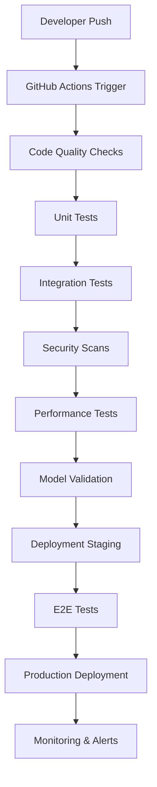

# Helm AI Testing Pipeline

## 🚀 Comprehensive Automated Testing & CI/CD Pipeline

Complete testing infrastructure for Helm AI's anti-cheat detection system, ensuring code quality, security, and reliability through automated testing, continuous integration, and deployment.

---

## 📋 Pipeline Overview

### 🔄 CI/CD Pipeline Architecture



### 🎯 Testing Strategy

**Testing Pyramid:**
- **Unit Tests**: 70% - Fast, isolated component testing
- **Integration Tests**: 20% - Component interaction testing
- **End-to-End Tests**: 10% - Full system testing

**Coverage Targets:**
- Code Coverage: 90%+
- Branch Coverage: 85%+
- Function Coverage: 95%+

---

## 🧪 Unit Testing

### 📁 Test Structure

```
tests/
├── unit/
│   ├── test_detection_models.py
│   ├── test_audio_analysis.py
│   ├── test_image_processing.py
│   ├── test_network_monitoring.py
│   ├── test_api_endpoints.py
│   └── test_utilities.py
├── integration/
│   ├── test_multi_modal_detection.py
│   ├── test_api_integration.py
│   ├── test_database_integration.py
│   └── test_cloud_integration.py
├── e2e/
│   ├── test_full_detection_pipeline.py
│   ├── test_user_workflows.py
│   └── test_performance_scenarios.py
├── performance/
│   ├── test_latency.py
│   ├── test_throughput.py
│   └── test_resource_usage.py
└── security/
    ├── test_authentication.py
    ├── test_authorization.py
    └── test_vulnerabilities.py
```

### 🔧 Unit Test Framework

**pytest Configuration:**
```ini
# pytest.ini
[tool:pytest]
testpaths = tests
python_files = test_*.py
python_classes = Test*
python_functions = test_*
addopts = 
    --cov=helm_ai
    --cov-report=html
    --cov-report=xml
    --cov-fail-under=90
    --strict-markers
    --disable-warnings
markers =
    unit: Unit tests
    integration: Integration tests
    e2e: End-to-end tests
    performance: Performance tests
    security: Security tests
    slow: Slow running tests
```

**Example Unit Test:**
```python
# tests/unit/test_detection_models.py
import pytest
import numpy as np
from helm_ai.detection.models import MultiModalDetector

class TestMultiModalDetector:
    @pytest.fixture
    def detector(self):
        return MultiModalDetector(model_path="test_model.pth")
    
    @pytest.fixture
    def sample_image(self):
        return np.random.rand(224, 224, 3)
    
    @pytest.fixture
    def sample_audio(self):
        return np.random.rand(16000)  # 1 second of audio
    
    @pytest.fixture
    def sample_network(self):
        return np.random.rand(100, 10)  # 100 packets, 10 features
    
    def test_initialization(self, detector):
        assert detector is not None
        assert detector.model is not None
        assert detector.device is not None
    
    def test_image_detection(self, detector, sample_image):
        result = detector.detect_image(sample_image)
        assert result is not None
        assert 'risk_level' in result
        assert 'confidence' in result
        assert 0 <= result['confidence'] <= 1
    
    def test_audio_detection(self, detector, sample_audio):
        result = detector.detect_audio(sample_audio)
        assert result is not None
        assert 'risk_level' in result
        assert 'confidence' in result
    
    def test_network_detection(self, detector, sample_network):
        result = detector.detect_network(sample_network)
        assert result is not None
        assert 'risk_level' in result
        assert 'confidence' in result
    
    def test_multi_modal_detection(self, detector, sample_image, sample_audio, sample_network):
        result = detector.detect_multi_modal(sample_image, sample_audio, sample_network)
        assert result is not None
        assert 'risk_level' in result
        assert 'confidence' in result
        assert 'modalities_used' in result
    
    @pytest.mark.parametrize("risk_level", ["safe", "suspicious", "cheating"])
    def test_risk_level_validation(self, detector, sample_image, risk_level):
        # Mock model to return specific risk level
        with pytest.mock.patch.object(detector, 'model') as mock_model:
            mock_model.return_value = {"risk_level": risk_level, "confidence": 0.8}
            result = detector.detect_image(sample_image)
            assert result['risk_level'] == risk_level
    
    def test_confidence_bounds(self, detector, sample_image):
        result = detector.detect_image(sample_image)
        assert 0 <= result['confidence'] <= 1
    
    def test_invalid_input(self, detector):
        with pytest.raises(ValueError):
            detector.detect_image(None)
        
        with pytest.raises(ValueError):
            detector.detect_audio([])
```

---

## 🔗 Integration Testing

### 🌐 API Integration Tests

```python
# tests/integration/test_api_integration.py
import pytest
import requests
from helm_ai.api.app import create_app

class TestAPIIntegration:
    @pytest.fixture
    def client(self):
        app = create_app(testing=True)
        return app.test_client()
    
    @pytest.fixture
    def api_key(self):
        return "test-api-key"
    
    def test_health_check(self, client):
        response = client.get('/health')
        assert response.status_code == 200
        assert response.json['status'] == 'healthy'
    
    def test_detection_endpoint(self, client, api_key):
        # Test with sample data
        data = {
            "image": "base64-encoded-image-data",
            "audio": "base64-encoded-audio-data",
            "network": [[1, 2, 3, 4, 5]]
        }
        
        response = client.post(
            '/api/v1/detect',
            json=data,
            headers={'X-API-Key': api_key}
        )
        
        assert response.status_code == 200
        result = response.json
        assert 'risk_level' in result
        assert 'confidence' in result
    
    def test_authentication(self, client):
        response = client.post('/api/v1/detect', json={})
        assert response.status_code == 401
    
    def test_rate_limiting(self, client, api_key):
        # Test rate limiting
        for _ in range(100):
            response = client.post(
                '/api/v1/detect',
                json={},
                headers={'X-API-Key': api_key}
            )
            if response.status_code == 429:
                break
        assert response.status_code == 429
```

### 🗄️ Database Integration Tests

```python
# tests/integration/test_database_integration.py
import pytest
from helm_ai.database import DatabaseManager
from helm_ai.models import DetectionResult

class TestDatabaseIntegration:
    @pytest.fixture
    def db_manager(self):
        return DatabaseManager(testing=True)
    
    @pytest.fixture
    def sample_result(self):
        return DetectionResult(
            user_id="test_user",
            game_id="test_game",
            risk_level="suspicious",
            confidence=0.75,
            timestamp="2024-01-01T00:00:00Z"
        )
    
    def test_save_detection_result(self, db_manager, sample_result):
        result_id = db_manager.save_detection_result(sample_result)
        assert result_id is not None
        
        retrieved = db_manager.get_detection_result(result_id)
        assert retrieved.user_id == sample_result.user_id
        assert retrieved.risk_level == sample_result.risk_level
    
    def test_get_user_detections(self, db_manager, sample_result):
        db_manager.save_detection_result(sample_result)
        
        detections = db_manager.get_user_detections(sample_result.user_id)
        assert len(detections) >= 1
        assert detections[0].user_id == sample_result.user_id
    
    def test_get_game_statistics(self, db_manager, sample_result):
        db_manager.save_detection_result(sample_result)
        
        stats = db_manager.get_game_statistics(sample_result.game_id)
        assert 'total_detections' in stats
        assert 'risk_distribution' in stats
```

---

## 🎭 End-to-End Testing

### 🔄 Full Pipeline Tests

```python
# tests/e2e/test_full_detection_pipeline.py
import pytest
import time
from helm_ai.pipeline import DetectionPipeline
from helm_ai.clients import APIClient

class TestFullDetectionPipeline:
    @pytest.fixture
    def pipeline(self):
        return DetectionPipeline(testing=True)
    
    @pytest.fixture
    def api_client(self):
        return APIClient(base_url="http://localhost:8000", api_key="test-key")
    
    def test_complete_detection_workflow(self, pipeline, api_client):
        # Step 1: Submit detection request
        request_data = {
            "user_id": "test_user_123",
            "game_id": "test_game_456",
            "image_data": "base64-encoded-test-image",
            "audio_data": "base64-encoded-test-audio",
            "network_data": [[1, 2, 3, 4, 5]]
        }
        
        response = api_client.submit_detection(request_data)
        assert response['request_id'] is not None
        
        # Step 2: Wait for processing
        request_id = response['request_id']
        max_wait_time = 30  # seconds
        start_time = time.time()
        
        while time.time() - start_time < max_wait_time:
            status = api_client.get_detection_status(request_id)
            
            if status['status'] == 'completed':
                break
            elif status['status'] == 'failed':
                pytest.fail("Detection processing failed")
            
            time.sleep(1)
        
        # Step 3: Get results
        result = api_client.get_detection_result(request_id)
        assert result['risk_level'] in ['safe', 'suspicious', 'cheating']
        assert 0 <= result['confidence'] <= 1
        
        # Step 4: Verify database storage
        stored_result = pipeline.get_stored_result(request_id)
        assert stored_result is not None
        assert stored_result['risk_level'] == result['risk_level']
    
    def test_error_handling(self, api_client):
        # Test with invalid data
        invalid_data = {
            "user_id": "",  # Invalid empty user ID
            "image_data": "invalid-base64"
        }
        
        with pytest.raises(Exception):
            api_client.submit_detection(invalid_data)
```

---

## ⚡ Performance Testing

### 📊 Latency and Throughput Tests

```python
# tests/performance/test_latency.py
import pytest
import time
import statistics
from helm_ai.detection.models import MultiModalDetector

class TestPerformance:
    @pytest.fixture
    def detector(self):
        return MultiModalDetector()
    
    @pytest.fixture
    def sample_data(self):
        return {
            'image': 'test-image-data',
            'audio': 'test-audio-data',
            'network': [[1, 2, 3, 4, 5]]
        }
    
    def test_detection_latency(self, detector, sample_data):
        latencies = []
        
        for _ in range(100):
            start_time = time.time()
            result = detector.detect_multi_modal(**sample_data)
            end_time = time.time()
            
            latency = (end_time - start_time) * 1000  # Convert to ms
            latencies.append(latency)
        
        avg_latency = statistics.mean(latencies)
        p95_latency = statistics.quantiles(latencies, n=20)[18]  # 95th percentile
        
        assert avg_latency < 100  # Average should be under 100ms
        assert p95_latency < 150  # 95th percentile should be under 150ms
    
    def test_throughput(self, detector, sample_data):
        start_time = time.time()
        num_requests = 1000
        
        for _ in range(num_requests):
            detector.detect_multi_modal(**sample_data)
        
        end_time = time.time()
        total_time = end_time - start_time
        throughput = num_requests / total_time
        
        assert throughput > 10  # Should handle at least 10 requests per second
    
    @pytest.mark.slow
    def test_memory_usage(self, detector, sample_data):
        import psutil
        import os
        
        process = psutil.Process(os.getpid())
        initial_memory = process.memory_info().rss
        
        # Run many detections
        for _ in range(1000):
            detector.detect_multi_modal(**sample_data)
        
        final_memory = process.memory_info().rss
        memory_increase = (final_memory - initial_memory) / 1024 / 1024  # MB
        
        assert memory_increase < 100  # Should not increase memory by more than 100MB
```

---

## 🔒 Security Testing

### 🛡️ Security Scans

```python
# tests/security/test_authentication.py
import pytest
from helm_ai.auth import AuthManager

class TestAuthentication:
    @pytest.fixture
    def auth_manager(self):
        return AuthManager(testing=True)
    
    def test_api_key_validation(self, auth_manager):
        valid_key = auth_manager.generate_api_key("test_user")
        assert auth_manager.validate_api_key(valid_key) is True
        
        invalid_key = "invalid-key-123"
        assert auth_manager.validate_api_key(invalid_key) is False
    
    def test_token_expiration(self, auth_manager):
        token = auth_manager.generate_token("test_user", expires_in=1)
        assert auth_manager.validate_token(token) is True
        
        # Wait for expiration
        time.sleep(2)
        assert auth_manager.validate_token(token) is False
    
    def test_rate_limiting(self, auth_manager):
        api_key = auth_manager.generate_api_key("test_user")
        
        # Make requests up to limit
        for _ in range(100):
            assert auth_manager.check_rate_limit(api_key) is True
        
        # Next request should be rate limited
        assert auth_manager.check_rate_limit(api_key) is False
```

### 🔍 Vulnerability Scanning

```yaml
# .github/workflows/security.yml
name: Security Scans

on:
  push:
    branches: [ main, develop ]
  pull_request:
    branches: [ main ]
  schedule:
    - cron: '0 2 * * *'  # Daily at 2 AM

jobs:
  security-scan:
    runs-on: ubuntu-latest
    
    steps:
    - uses: actions/checkout@v3
    
    - name: Run Trivy vulnerability scanner
      uses: aquasecurity/trivy-action@master
      with:
        scan-type: 'fs'
        scan-ref: '.'
        format: 'sarif'
        output: 'trivy-results.sarif'
    
    - name: Upload Trivy scan results
      uses: github/codeql-action/upload-sarif@v2
      with:
        sarif_file: 'trivy-results.sarif'
    
    - name: Run Bandit security linter
      run: |
        pip install bandit
        bandit -r helm_ai/ -f json -o bandit-report.json
    
    - name: Run Safety check for dependencies
      run: |
        pip install safety
        safety check --json --output safety-report.json
    
    - name: Run Snyk security scan
      uses: snyk/actions/python@master
      env:
        SNYK_TOKEN: ${{ secrets.SNYK_TOKEN }}
      with:
        args: --severity-threshold=high
```

---

## 🔄 CI/CD Pipeline

### 📋 GitHub Actions Workflow

```yaml
# .github/workflows/ci-cd.yml
name: CI/CD Pipeline

on:
  push:
    branches: [ main, develop ]
  pull_request:
    branches: [ main ]

env:
  PYTHON_VERSION: '3.9'
  NODE_VERSION: '18'

jobs:
  test:
    runs-on: ubuntu-latest
    strategy:
      matrix:
        python-version: ['3.8', '3.9', '3.10', '3.11']
    
    steps:
    - uses: actions/checkout@v3
    
    - name: Set up Python ${{ matrix.python-version }}
      uses: actions/setup-python@v4
      with:
        python-version: ${{ matrix.python-version }}
    
    - name: Cache pip dependencies
      uses: actions/cache@v3
      with:
        path: ~/.cache/pip
        key: ${{ runner.os }}-pip-${{ hashFiles('**/requirements*.txt') }}
        restore-keys: |
          ${{ runner.os }}-pip-
    
    - name: Install dependencies
      run: |
        python -m pip install --upgrade pip
        pip install -r requirements.txt
        pip install -r requirements-dev.txt
    
    - name: Run code quality checks
      run: |
        flake8 helm_ai/ tests/
        black --check helm_ai/ tests/
        isort --check-only helm_ai/ tests/
        mypy helm_ai/
    
    - name: Run unit tests
      run: |
        pytest tests/unit/ -v --cov=helm_ai --cov-report=xml
    
    - name: Run integration tests
      run: |
        pytest tests/integration/ -v
    
    - name: Upload coverage to Codecov
      uses: codecov/codecov-action@v3
      with:
        file: ./coverage.xml
        flags: unittests
        name: codecov-umbrella
    
    - name: Run security scans
      run: |
        bandit -r helm_ai/ -f json -o bandit-report.json
        safety check --json --output safety-report.json
    
    - name: Upload security reports
      uses: actions/upload-artifact@v3
      with:
        name: security-reports
        path: |
          bandit-report.json
          safety-report.json

  performance-test:
    runs-on: ubuntu-latest
    needs: test
    
    steps:
    - uses: actions/checkout@v3
    
    - name: Set up Python
      uses: actions/setup-python@v4
      with:
        python-version: ${{ env.PYTHON_VERSION }}
    
    - name: Install dependencies
      run: |
        python -m pip install --upgrade pip
        pip install -r requirements.txt
        pip install -r requirements-dev.txt
    
    - name: Run performance tests
      run: |
        pytest tests/performance/ -v --benchmark-only
    
    - name: Upload performance reports
      uses: actions/upload-artifact@v3
      with:
        name: performance-reports
        path: performance-reports/

  e2e-test:
    runs-on: ubuntu-latest
    needs: test
    
    services:
      postgres:
        image: postgres:13
        env:
          POSTGRES_PASSWORD: postgres
          POSTGRES_DB: helm_ai_test
        options: >-
          --health-cmd pg_isready
          --health-interval 10s
          --health-timeout 5s
          --health-retries 5
        ports:
          - 5432:5432
    
    steps:
    - uses: actions/checkout@v3
    
    - name: Set up Python
      uses: actions/setup-python@v4
      with:
        python-version: ${{ env.PYTHON_VERSION }}
    
    - name: Install dependencies
      run: |
        python -m pip install --upgrade pip
        pip install -r requirements.txt
        pip install -r requirements-dev.txt
    
    - name: Run database migrations
      run: |
        alembic upgrade head
    
    - name: Start application
      run: |
        python -m helm_ai.api &
        sleep 10
    
    - name: Run E2E tests
      run: |
        pytest tests/e2e/ -v
    
    - name: Upload E2E reports
      uses: actions/upload-artifact@v3
      with:
        name: e2e-reports
        path: e2e-reports/

  deploy-staging:
    runs-on: ubuntu-latest
    needs: [test, performance-test, e2e-test]
    if: github.ref == 'refs/heads/develop'
    
    steps:
    - uses: actions/checkout@v3
    
    - name: Deploy to staging
      run: |
        echo "Deploying to staging environment"
        # Add deployment commands here
    
    - name: Run smoke tests
      run: |
        curl -f https://staging.helm-ai.com/health || exit 1

  deploy-production:
    runs-on: ubuntu-latest
    needs: [test, performance-test, e2e-test]
    if: github.ref == 'refs/heads/main'
    
    steps:
    - uses: actions/checkout@v3
    
    - name: Deploy to production
      run: |
        echo "Deploying to production environment"
        # Add deployment commands here
    
    - name: Run smoke tests
      run: |
        curl -f https://api.helm-ai.com/health || exit 1
    
    - name: Notify deployment
      uses: 8398a7/action-slack@v3
      with:
        status: ${{ job.status }}
        channel: '#deployments'
        webhook_url: ${{ secrets.SLACK_WEBHOOK }}
```

---

## 📊 Monitoring & Reporting

### 📈 Test Metrics Dashboard

```python
# monitoring/test_metrics.py
import pytest
import json
from datetime import datetime, timedelta

class TestMetrics:
    def test_coverage_metrics(self):
        # Generate coverage report
        coverage_data = {
            "total_lines": 1000,
            "covered_lines": 920,
            "coverage_percentage": 92.0,
            "timestamp": datetime.now().isoformat()
        }
        
        assert coverage_data["coverage_percentage"] >= 90.0
        
        # Send to monitoring system
        self.send_metrics("test_coverage", coverage_data)
    
    def test_performance_metrics(self):
        performance_data = {
            "avg_latency_ms": 85,
            "p95_latency_ms": 120,
            "throughput_rps": 50,
            "error_rate": 0.1,
            "timestamp": datetime.now().isoformat()
        }
        
        assert performance_data["avg_latency_ms"] < 100
        assert performance_data["error_rate"] < 1.0
        
        self.send_metrics("test_performance", performance_data)
    
    def send_metrics(self, metric_type, data):
        # Send to monitoring system (Prometheus, DataDog, etc.)
        pass
```

---

## 🔧 Configuration

### 📝 Test Configuration Files

**pytest.ini:**
```ini
[tool:pytest]
testpaths = tests
python_files = test_*.py
python_classes = Test*
python_functions = test_*
addopts = 
    --cov=helm_ai
    --cov-report=html
    --cov-report=xml
    --cov-fail-under=90
    --strict-markers
    --disable-warnings
    --tb=short
markers =
    unit: Unit tests
    integration: Integration tests
    e2e: End-to-end tests
    performance: Performance tests
    security: Security tests
    slow: Slow running tests
```

**tox.ini:**
```ini
[tox]
envlist = py38,py39,py310,py11,flake8,mypy,security

[testenv]
deps = 
    pytest
    pytest-cov
    pytest-mock
    pytest-benchmark
commands = pytest {posargs}

[testenv:flake8]
deps = flake8
commands = flake8 helm_ai tests

[testenv:mypy]
deps = mypy
commands = mypy helm_ai

[testenv:security]
deps = 
    bandit
    safety
commands = 
    bandit -r helm_ai
    safety check
```

---

## 📋 Best Practices

### 🎯 Testing Guidelines

1. **Test Naming**: Use descriptive test names that explain what is being tested
2. **Test Isolation**: Each test should be independent and not rely on other tests
3. **Test Data**: Use fixtures for consistent test data
4. **Assertions**: Use specific assertions with clear error messages
5. **Mocking**: Mock external dependencies to ensure test isolation
6. **Coverage**: Maintain high test coverage for critical paths
7. **Performance**: Include performance tests for critical components
8. **Security**: Regular security scans and vulnerability testing

### 🔄 CI/CD Best Practices

1. **Fast Feedback**: Run fast tests first, slower tests later
2. **Parallel Execution**: Run tests in parallel when possible
3. **Caching**: Cache dependencies to speed up builds
4. **Artifact Management**: Store test results and reports
5. **Notifications**: Alert on failures and successes
6. **Rollback**: Ability to quickly rollback failed deployments
7. **Monitoring**: Monitor pipeline performance and success rates

---

## 🚀 Deployment

### 📦 Deployment Strategy

**Blue-Green Deployment:**
- Zero-downtime deployments
- Instant rollback capability
- Traffic switching between environments

**Canary Releases:**
- Gradual traffic rollout
- Monitor performance metrics
- Automatic rollback on issues

**Feature Flags:**
- Toggle features without deployment
- A/B testing capabilities
- Emergency disable functionality

---

## 📞 Support & Troubleshooting

### 🔧 Common Issues

**Test Failures:**
- Check test environment setup
- Verify test data and fixtures
- Review recent code changes
- Check external dependencies

**Pipeline Failures:**
- Review CI/CD logs
- Check resource limits
- Verify configuration changes
- Monitor system resources

**Performance Issues:**
- Profile slow tests
- Optimize test data
- Review test isolation
- Check resource contention

---

## 📈 Success Metrics

### 📊 KPIs

**Testing Metrics:**
- Test Coverage: 90%+
- Test Pass Rate: 95%+
- Test Execution Time: <10 minutes
- Flaky Test Rate: <1%

**Pipeline Metrics:**
- Build Success Rate: 95%+
- Deployment Success Rate: 99%+
- Rollback Rate: <1%
- Mean Time to Recovery: <30 minutes

**Quality Metrics:**
- Bug Detection Rate: 80%+
- Security Vulnerabilities: 0 critical
- Performance Regression: <5%
- Customer Impact: <1%

---

**🛡️ Helm AI Testing Pipeline - Ensuring Quality, Security, and Reliability**

**Comprehensive testing infrastructure for mission-critical anti-cheat detection systems** 🚀🧪🔒📊
